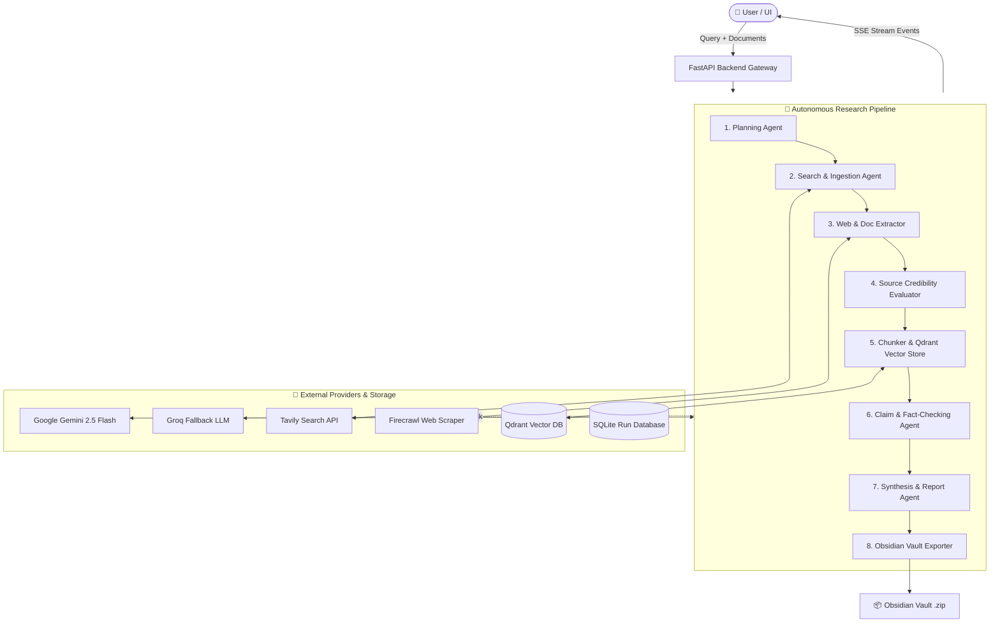

# 🧠 ResearchPilot AI (ResearchLLM)

[](https://fastapi.tiangolo.com)
[](https://nextjs.org/)
[](https://react.dev/)
[](https://tailwindcss.com/)
[](https://www.python.org/)
[](https://qdrant.tech/)
[](https://ai.google.dev/)
[](https://groq.com/)

> **Autonomous Multi-Agent AI Research Synthesizer & Obsidian Knowledge Vault Generator**  
> Transform complex research queries, web searches, and user-uploaded documents into deep structured reports, verified evidence graphs, and downloadable **Obsidian Knowledge Vaults** in seconds.

---

## 📑 Table of Contents
- [✨ Key Features](#-key-features)
- [🏛️ System Architecture](#️-system-architecture)
- [🔄 Multi-Agent Research Pipeline](#-multi-agent-research-pipeline)
- [📁 Project Structure](#-project-structure)
- [🚀 Quick Start](#-quick-start)
  - [Prerequisites](#prerequisites)
  - [One-Click Start (Windows)](#one-click-start-windows)
  - [Manual Setup (macOS / Linux / Windows)](#manual-setup-macos--linux--windows)
- [⚙️ Environment Configuration](#️-environment-configuration)
- [🔌 API Endpoints](#-api-endpoints)
- [🧪 Testing & Mock Mode](#-testing--mock-mode)
- [🚢 Deployment](#-deployment)
- [📄 License](#-license)

---

## ✨ Key Features

- **🤖 Autonomous Multi-Agent Orchestration**: Specialized agents work in harmony across planning, deep web search, content scraping, source evaluation, semantic chunking, fact-checking, report synthesis, and knowledge vault exporting.
- **⚡ Dual-LLM Resilience with Automatic Fallback**: High-speed, high-context **Google Gemini 2.5 Flash** as primary engine with automatic failover to **Groq** (`openai/gpt-oss-120b`).
- **🌐 Multi-Source Ingestion**:
  - **Live Web Search**: Integrated **Tavily AI Search** for clean, relevant academic and technical search results.
  - **Web Extraction**: High-fidelity page extraction with **Firecrawl** and fallback to asynchronous **HTTPX + BeautifulSoup4 + LXML**.
  - **Document Parsing**: Direct upload and text extraction from **PDF**, **DOCX**, **TXT**, **Markdown**, and **CSV** files.
  - **Custom Target URLs**: Provide specific URLs for focused domain research.
- **🧠 Vector RAG & Semantic Memory**: Integrated **Qdrant Vector Database** with local `sentence-transformers` (`BAAI/bge-small-en-v1.5`) embeddings for dense retrieval, citation grounding, and evidence verification.
- **🔍 Automated Claim & Contradiction Detection**: Extracts factual claims, calculates verification confidence scores, cross-references sources, and flags conflicting evidence.
- **📓 Direct Obsidian Knowledge Vault Export**: Generates linked Markdown notes with YAML frontmatter, backlinks (`[[...]]`), hierarchical tags, canvas visual graphs, and downloadable `.zip` vaults ready to drag-and-drop into Obsidian.
- **📡 Real-Time SSE Streaming**: Live event streaming (Server-Sent Events) displaying real-time agent thoughts, stage progression, extracted evidence, and timeline metrics.
- **🎨 Modern Interactive UI**: Built with Next.js 16, React 19, Tailwind CSS v4, and Framer Motion animations with dark mode, interactive graphs, and evidence drawers.

---

## 🏛️ System Architecture



---

## 🔄 Multi-Agent Research Pipeline

| Stage | Name | Role & Output |
|---|---|---|
| **1** | **Planning** | Analyzes research query, determines depth, decomposes into sub-questions, and generates targeted search queries. |
| **2** | **Searching** | Executes queries via Tavily AI Search and ingests user-uploaded documents and custom URLs. |
| **3** | **Extraction** | Extracts clean markdown/text content using Firecrawl or HTTPX + BeautifulSoup4 + LXML. |
| **4** | **Evaluation** | Scores source authority, credibility, relevance, and recency. |
| **5** | **Embedding & RAG** | Performs recursive token chunking and stores vectors in Qdrant with `bge-small-en-v1.5`. |
| **6** | **Fact-Checking** | Extracts key claims, finds corroborating/conflicting evidence, and computes verification confidence. |
| **7** | **Synthesis** | Composes structured report with executive summary, key findings, deep-dive sections, and citations. |
| **8** | **Obsidian Export**| Builds interconnected Obsidian markdown notes, metadata frontmatter, graph relationships, and `.zip` archive. |

---

## 📁 Project Structure

```
research_ai/
├── backend/
│   ├── app/
│   │   ├── agents/            # Multi-agent orchestrator & pipeline logic
│   │   │   └── orchestrator.py
│   │   ├── api/               # FastAPI route controllers
│   │   │   ├── health.py      # Health & status endpoints
│   │   │   └── research.py    # Research, streaming, upload, export endpoints
│   │   ├── llm/               # Dual-provider LLM service (Gemini + Groq)
│   │   ├── prompts/           # Specialized prompt templates
│   │   ├── rag/               # Qdrant vector store, chunker, & retriever
│   │   ├── schemas/           # Pydantic data schemas & state models
│   │   ├── services/          # Document parser, Tavily, Firecrawl, Obsidian export
│   │   ├── storage/           # SQLite persistence & mock data
│   │   ├── config.py          # App settings & environment loader
│   │   └── main.py            # FastAPI server entry point
│   ├── requirements.txt       # Python backend dependencies
│   └── .env                   # Backend environment variables
├── frontend/
│   ├── src/
│   │   ├── app/               # Next.js App Router pages & layouts
│   │   ├── components/        # Interactive UI components & drawers
│   │   │   ├── AgentPipeline.tsx
│   │   │   ├── EvidenceInspector.tsx
│   │   │   ├── ObsidianVaultView.tsx
│   │   │   ├── ReportView.tsx
│   │   │   ├── ResearchComposer.tsx
│   │   │   └── SourcesView.tsx
│   │   ├── hooks/             # Custom React hooks (SSE streaming, etc.)
│   │   ├── lib/               # Utility functions & API client
│   │   └── types/             # TypeScript definitions
│   ├── package.json           # Frontend dependencies & scripts
│   └── tsconfig.json
├── tests/                     # Unit and integration test suite
├── start.bat                  # One-click Windows startup script
├── stop.bat                   # Windows process termination script
├── vercel.json                # Vercel deployment configuration
├── .env.example               # Template environment configuration
└── README.md
```

---

## 🚀 Quick Start

### Prerequisites
- **Python 3.10+**
- **Node.js 18+** & **npm**
- **Git**
- *(Optional)* Gemini / Groq / Tavily / Qdrant API keys (or run in `MOCK_MODE=true` for testing without API keys).

---

### One-Click Start (Windows)

1. Clone the repository:
   ```bash
   git clone https://github.com/Miteshreddy/ResearchLLM.git
   cd ResearchLLM
   ```
2. Copy environment file and add your keys:
   ```cmd
   copy .env.example .env
   ```
3. Run the automated startup script:
   ```cmd
   start.bat
   ```
> The script automatically configures Python venv, installs all backend & frontend dependencies, runs health checks, launches both servers, and opens `http://localhost:3000` in your browser.

---

### Manual Setup (macOS / Linux / Windows)

#### 1. Backend Setup
```bash
# Navigate to backend
cd backend

# Create & activate virtual environment
python -m venv .venv
# On Windows:
.venv\Scripts\activate
# On macOS/Linux:
source .venv/bin/activate

# Install dependencies
pip install --upgrade pip
pip install -r requirements.txt

# Start backend server (Port 8000)
uvicorn app.main:app --host 0.0.0.0 --port 8000 --reload
```

#### 2. Frontend Setup
```bash
# Open a new terminal and navigate to frontend
cd frontend

# Install packages
npm install

# Start Next.js development server (Port 3000)
npm run dev
```

Visit **`http://localhost:3000`** in your browser.  
API documentation is available at **`http://localhost:8000/docs`**.

---

## ⚙️ Environment Configuration

Create a `.env` file in the root directory (or `backend/.env`) based on `.env.example`:

```ini
# Google Gemini LLM (Primary Provider)
GEMINI_API_KEY=your_gemini_api_key_here
GEMINI_MODEL=gemini-2.5-flash

# Groq LLM (Automatic Fallback Provider)
GROQ_API_KEY=your_groq_api_key_here
GROQ_MODEL=openai/gpt-oss-120b

# Search & Extraction APIs
TAVILY_API_KEY=your_tavily_api_key_here
FIRECRAWL_API_KEY=your_firecrawl_api_key_here   # Optional (falls back to HTTPX/BS4)

# Qdrant Vector Database
QDRANT_URL=your_qdrant_cluster_url              # Optional (in-memory if empty)
QDRANT_API_KEY=your_qdrant_api_key              # Optional

# Mock Mode (Set to true to run offline tests without consuming API credits)
MOCK_MODE=false
```

---

## 🔌 API Endpoints

| Method | Endpoint | Description |
|---|---|---|
| `GET` | `/api/health` | Backend and external service health check |
| `POST` | `/api/research` | Initialize a new research pipeline run |
| `GET` | `/api/research/{run_id}` | Retrieve comprehensive research run status and payload |
| `GET` | `/api/research/{run_id}/events` | **Server-Sent Events (SSE)** live streaming updates |
| `POST` | `/api/research/upload` | Upload & parse research documents (PDF, DOCX, TXT, CSV) |
| `GET` | `/api/research/{run_id}/sources` | Get discovered and extracted sources with evaluations |
| `GET` | `/api/research/{run_id}/evidence` | Get extracted claims, fact-checks, and contradictions |
| `GET` | `/api/research/{run_id}/report` | Retrieve final synthesized report & statistics |
| `GET` | `/api/research/{run_id}/export/obsidian` | Download generated **Obsidian Vault (.zip)** |
| `GET` | `/api/research/history/list` | Retrieve past research runs from local database |

---

## 🧪 Testing & Mock Mode

Run tests with `pytest`:

```bash
# Activate backend virtual environment
cd backend
# Windows: .venv\Scripts\activate | macOS/Linux: source .venv/bin/activate

# Run test suite
pytest ../tests -v
```

To run the full UI and backend without external API keys, set `MOCK_MODE=true` in your `.env` file. ResearchPilot will generate realistic research workflows, simulated evidence graphs, and sample Obsidian vaults instantly.

---

## 🚢 Deployment

### Vercel / Cloud Platforms
The project includes multi-service configuration in [`vercel.json`](file:///c:/Users/Mitesh%20Reddy/Desktop/research_ai/vercel.json) allowing seamless deployment for both Next.js frontend and FastAPI backend.

### Docker (Optional)
The backend FastAPI application can be packaged into standard container runtimes with Uvicorn and Python 3.11+.

---

## 🤝 Contributing

Contributions, issues, and feature requests are welcome! Feel free to check the [issues page](https://github.com/Miteshreddy/ResearchLLM/issues).

1. Fork the Project
2. Create your Feature Branch (`git checkout -b feature/AmazingFeature`)
3. Commit your Changes (`git commit -m 'feat: Add some AmazingFeature'`)
4. Push to the Branch (`git push origin feature/AmazingFeature`)
5. Open a Pull Request

---

## 📄 License

Distributed under the **MIT License**. See `LICENSE` for more information.